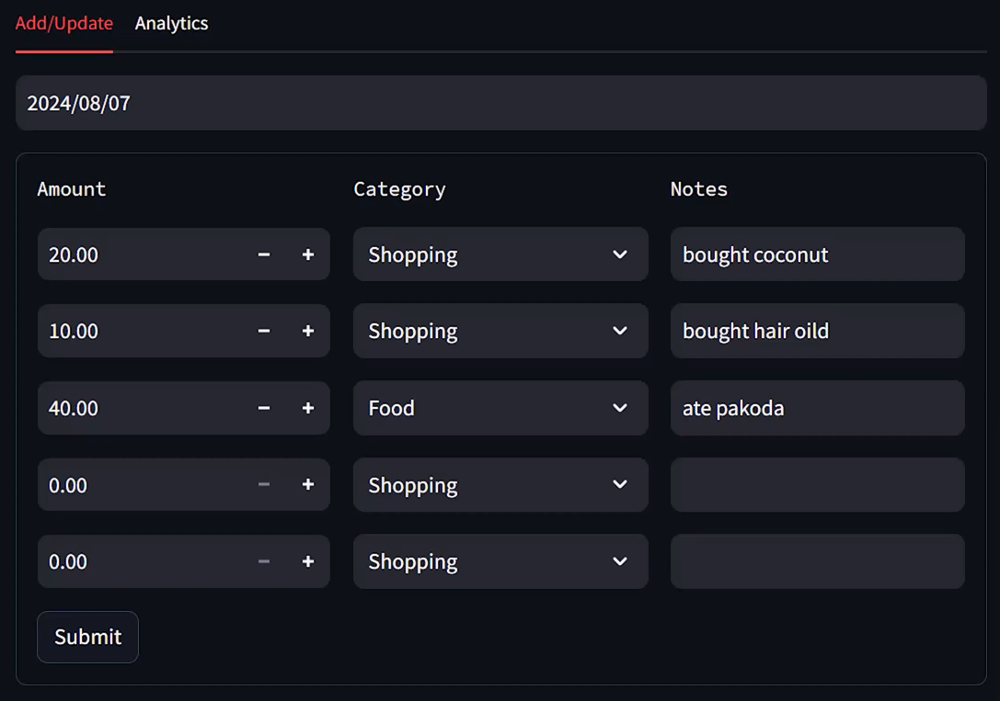
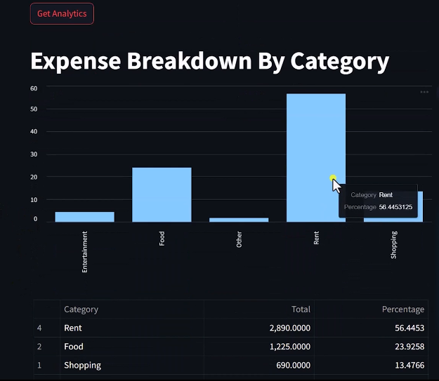

<div align="center">

```
╔═══════════════════════════════════════════════════════╗
║        EXPENSE MANAGEMENT SYSTEM  💸                  ║
║        Track · Analyse · Control                      ║
╚═══════════════════════════════════════════════════════╝
```


> **A full-stack expense tracking platform** — real-time REST API backend powered by FastAPI, paired with an interactive Streamlit dashboard. Built to demonstrate clean architecture, async Python, and production-ready API design.

---



---

[Features](#-features) · [Architecture](#-architecture) · [Quick Start](#-quick-start) · [API Reference](#-api-reference) · [Project Structure](#-project-structure) · [Tests](#-tests)

</div>

---

## 🎯 What Makes This Different

Most expense trackers are CRUD wrappers. This one is built with **separation of concerns** baked in from day one:

| Layer | Technology | Purpose |
|-------|-----------|---------|
| 🖥️ **Frontend** | Streamlit | Interactive dashboards, filters, and data visualisation |
| ⚡ **Backend** | FastAPI + Uvicorn | Async REST API with auto-generated OpenAPI docs |
| 🧪 **Testing** | Pytest | Unit + integration tests across both layers |

---

## ✨ Features

- 📊 **Live Dashboard** — visualise spending by category, date range, and amount
- ⚡ **Async API** — non-blocking endpoints built with FastAPI for high throughput
- 🔍 **Filter & Search** — slice expense data by date, category, and amount thresholds
- 📄 **Auto API Docs** — Swagger UI available at `/docs`, ReDoc at `/redoc` — zero extra work
- 🧪 **Tested** — backend routes and frontend logic covered by a dedicated test suite
- 🐍 **Pure Python** — no JS build steps, no Docker required to get started

---

## 🏗️ Architecture

```
┌─────────────────────────────────────────────────────┐
│                    CLIENT BROWSER                   │
└───────────────────────┬─────────────────────────────┘
                        │ HTTP
┌───────────────────────▼─────────────────────────────┐
│            STREAMLIT FRONTEND  :8501                │
│   app.py → renders charts, forms, expense tables    │
└───────────────────────┬─────────────────────────────┘
                        │ REST API calls
┌───────────────────────▼─────────────────────────────┐
│              FASTAPI BACKEND  :8000                 │
│   /expenses  GET · POST · PUT · DELETE              │
│   /summary   GET  (aggregations & totals)           │
│   /docs      Swagger UI (auto-generated)            │
└─────────────────────────────────────────────────────┘
```

---

## 📸 Screenshots

| Frontend UI | Analytics Demo 1 | Analytics Demo 2 |
|:-----------:|:----------------:|:----------------:|
|  |  |  |

---

## 🚀 Quick Start

**Prerequisites:** Python 3.10+

### 1 — Clone

```bash
git clone https://github.com/yourusername/expense-management-system.git
cd expense-management-system
```

### 2 — Install dependencies

```bash
pip install -r requirements.txt
```

### 3 — Start the API server

```bash
uvicorn server.server:app --reload
```

> API is live at `http://localhost:8000` · Swagger docs at `http://localhost:8000/docs`

### 4 — Launch the dashboard

```bash
# In a new terminal
streamlit run frontend/app.py
```

> Dashboard opens automatically at `http://localhost:8501`

---

## 📁 Project Structure

```
expense-management-system/
│
├── frontend/
│   └── app.py              # Streamlit dashboard & visualisations
│
├── backend/
│   └── server/
│       └── server.py       # FastAPI app, routes, and data models
│
├── tests/
│   ├── test_backend.py     # API endpoint tests (pytest)
│   └── test_frontend.py    # Frontend logic tests
│
├── requirements.txt        # All Python dependencies
└── README.md
```

---

## 🔌 API Reference

Once the server is running, full interactive docs are at **`http://localhost:8000/docs`**.

| Method | Endpoint | Description |
|--------|----------|-------------|
| `GET` | `/expenses` | List all expenses |
| `POST` | `/expenses` | Add a new expense |
| `PUT` | `/expenses/{id}` | Update an existing expense |
| `DELETE` | `/expenses/{id}` | Remove an expense |
| `GET` | `/summary` | Aggregated totals by category |

**Example — add an expense:**

```bash
curl -X POST "http://localhost:8000/expenses" \
     -H "Content-Type: application/json" \
     -d '{"title": "Lunch", "amount": 18.50, "category": "Food", "date": "2024-06-01"}'
```

---

## 🧪 Tests

```bash
# Run the full test suite
pytest tests/

# Run with verbose output
pytest tests/ -v

# Run only backend tests
pytest tests/test_backend.py
```

---

## 🧠 Skills Demonstrated

This project was built to showcase:

- ✅ **REST API design** with FastAPI — clean routing, Pydantic models, HTTP status codes
- ✅ **Async Python** — non-blocking request handling with Uvicorn
- ✅ **Frontend/backend separation** — decoupled layers communicating over HTTP
- ✅ **Data visualisation** — Streamlit charts and interactive filters
- ✅ **Testing discipline** — pytest for both layers
- ✅ **Clean project structure** — immediately navigable for any new contributor

---

## 📦 Dependencies

| Package | Role |
|---------|------|
| `fastapi` | Backend web framework |
| `uvicorn` | ASGI server for FastAPI |
| `streamlit` | Frontend dashboard |
| `pydantic` | Data validation & serialisation |
| `pytest` | Test runner |
| `httpx` | Async HTTP client (for tests) |

Install everything at once: `pip install -r requirements.txt`

---

<div align="center">

**Built with Python · FastAPI · Streamlit**

If this project was useful, a ⭐ on GitHub goes a long way.

</div>


**Built with Python · FastAPI · Streamlit**

If this project was useful, a ⭐ on GitHub goes a long way.

</div>
